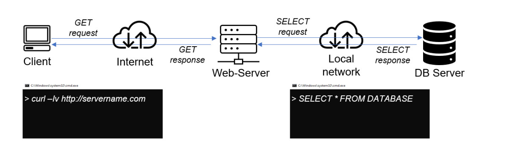
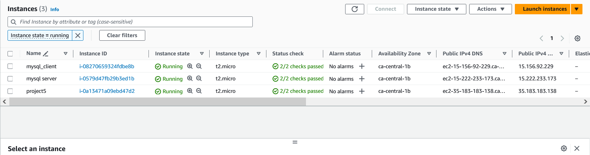
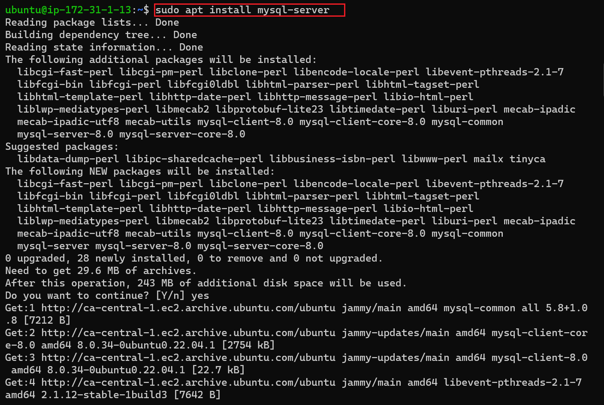
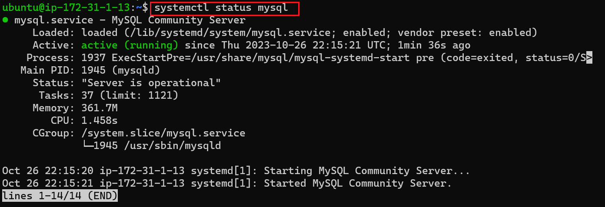
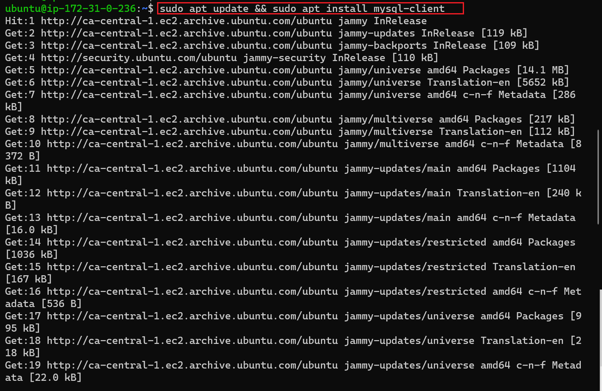
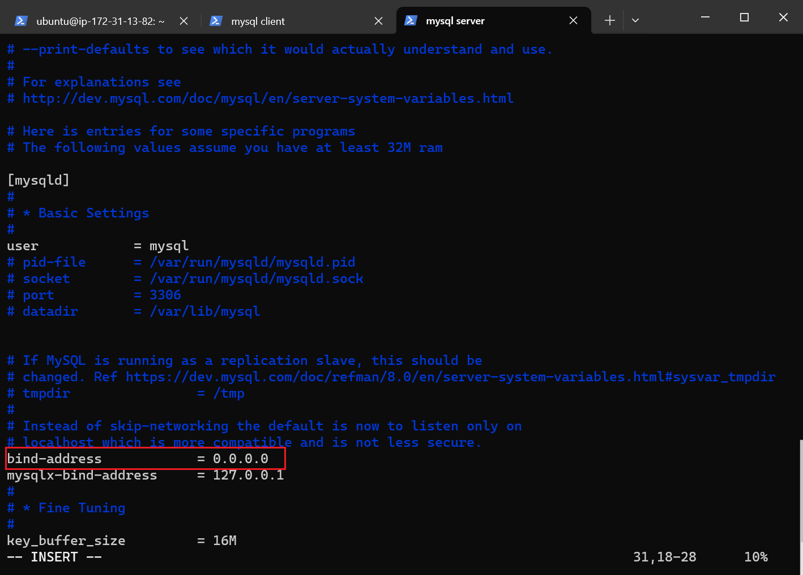
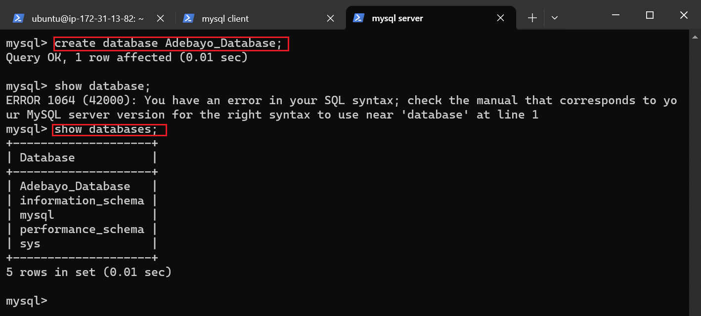
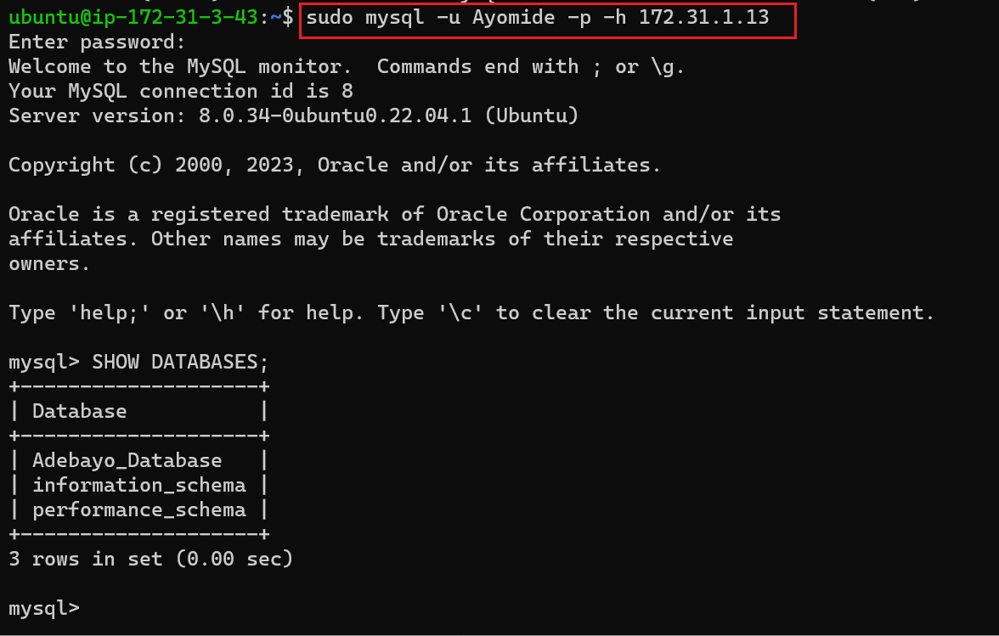

# Implementing-a-Client-Server-Architecture-Using-MySQL-server-and-MYSQL-client

This project is to display my ability to create a client server architecture using MYSQL server created on EC2 instances (client and server) creating a connection between the instances as shown below 

To demonstrate Client-Server architecture we will be using two EC2 instance with mysql server and mysql client respectively by Creating and configuring two Ubuntu-based virtual servers (EC2 instances in the same subnet). as shown below 

On mysql server we install MySQL Server software by running `sudo apt install mysql-server`.  

On mysql client Server install MySQL Client software. `sudo apt install mysql-client` 

we now open port 3306 on Mysql-server to allow connection from the mysql client server. Both server can communicate using private IPs since they belong to the same subnet 

Change bind-address on Mysql-server to allow for connection from any IP address. Set the bind-address to 0.0.0.0 using the command:
`sudo vi /etc/mysql/mysql.conf.d/mysqld.cnf`

we then proceed to access the database from the mysql server by running `sudo mysql` and creating additional databases as shown below 
We then create a new user and grant all database permission to the new user as show below  
we then exit the mysql server and run a restart command on the mysql server using `sudo systemctl restart mysql`.

From mysql client Server we can proceed to connect remotely to mysql server Database Engine without using SSH by running `sudo mysql -u [username] -p -h [mysql_server_private_IP]` as shown below  

from here we can successfully connected to the remote MySQL server and can perform SQL queries.

